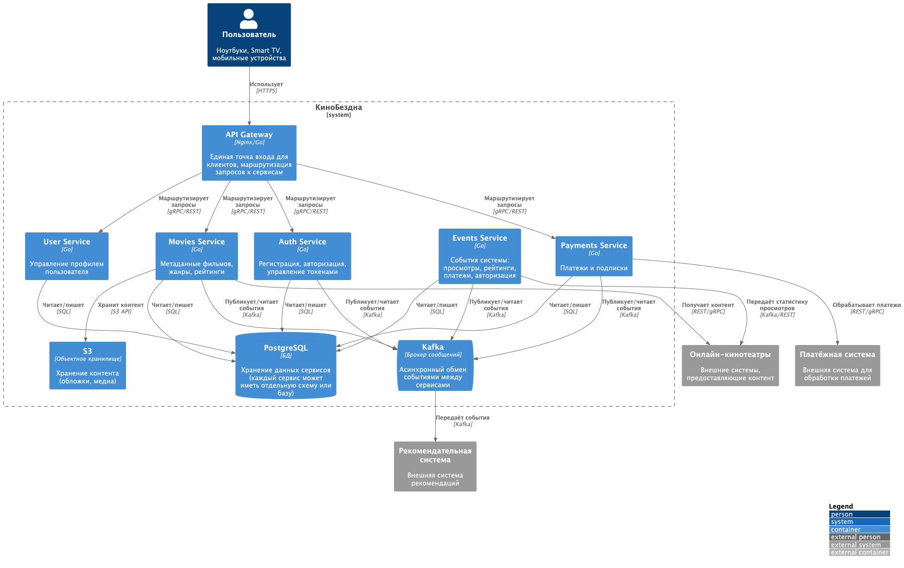
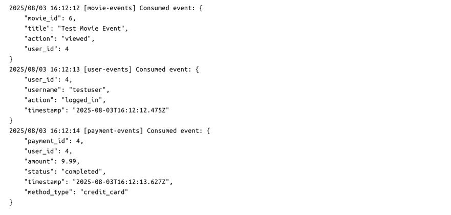
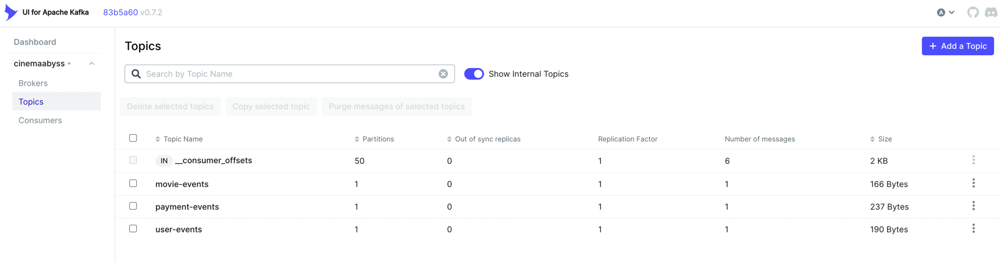
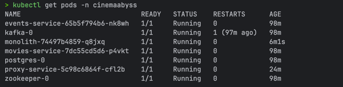
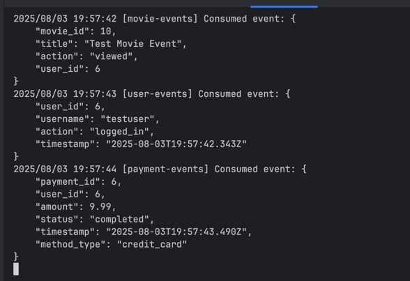
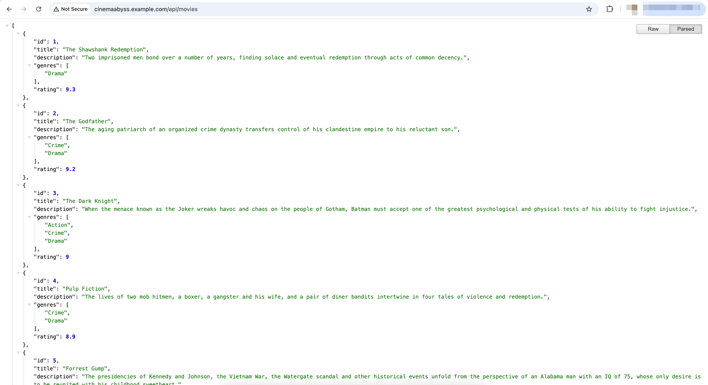
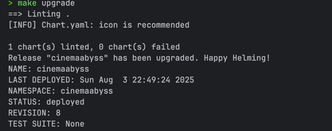

## Изучите [README.md](README.md) файл и структуру проекта.

## Задание 1. Архитектура КиноБездна (To-Be)

### Основные домены

- **Auth Service** — регистрация, авторизация, управление токенами.
- **User Service** — управление профилем пользователя.
- **Movies Service** — метаданные фильмов, рейтинги, жанры.
- **Payments Service** — платежи и подписки.
- **Events Service** — события системы (просмотры, рейтинги, платежи, авторизация).

### Интеграционное взаимодействие

- **API Gateway** — фронтовая точка для клиентов, маршрутизация между сервисами и монолитом.
- **Kafka** — обмен событиями между сервисами (Movies, Billing, Events) и внешними системами.
- **PostgreSQL** — каждая сервисная группа может иметь отдельную схему или базу данных.
- **S3** — хранение контента.
- **Внешние интеграции** — синхронно через REST/gRPC или асинхронно через Kafka.

### Контейнерная диаграмма (C4)



### Ключевые моменты

- **Единая точка входа**: API Gateway скрывает внутреннюю архитектуру.
- **Постепенная миграция**: Монолит остаётся до переноса всего функционала.
- **Событийная интеграция**: Kafka используется для асинхронных процессов (рекомендации, аналитика).
- **Микросервисная изоляция**: Каждый сервис имеет собственную логику и доступ к данным.
- **Инфраструктура готова к Kubernetes и Helm**: сервисы контейнеризируются и оркестрируются.


## Задание 2. Proxy и Events (Kafka) Services

### Результаты тестов

### Логи обработки событий

### Состояния топиков Kafka


## Задание 3

### Список подов


### Логи Events Service


### Получение списка фильмов



## Задание 4

### Скриншот развертывания helm


# Задание 5
Компания планирует активно развиваться и для повышения надежности, безопасности, реализации сетевых паттернов типа Circuit Breaker и канареечного деплоя вам как архитектору необходимо развернуть istio и настроить circuit breaker для monolith и movies сервисов.

```bash

helm repo add istio https://istio-release.storage.googleapis.com/charts
helm repo update

helm install istio-base istio/base -n istio-system --set defaultRevision=default --create-namespace
helm install istio-ingressgateway istio/gateway -n istio-system
helm install istiod istio/istiod -n istio-system --wait

helm install cinemaabyss .\src\kubernetes\helm --namespace cinemaabyss --create-namespace

kubectl label namespace cinemaabyss istio-injection=enabled --overwrite

kubectl get namespace -L istio-injection

kubectl apply -f .\src\kubernetes\circuit-breaker-config.yaml -n cinemaabyss

```

Тестирование

# fortio
```bash
kubectl apply -f https://raw.githubusercontent.com/istio/istio/release-1.25/samples/httpbin/sample-client/fortio-deploy.yaml -n cinemaabyss
```

# Get the fortio pod name
```bash
FORTIO_POD=$(kubectl get pod -n cinemaabyss | grep fortio | awk '{print $1}')

kubectl exec -n cinemaabyss $FORTIO_POD -c fortio -- fortio load -c 50 -qps 0 -n 500 -loglevel Warning http://movies-service:8081/api/movies
```
Например,

```bash
kubectl exec -n cinemaabyss fortio-deploy-b6757cbbb-7c9qg  -c fortio -- fortio load -c 50 -qps 0 -n 500 -loglevel Warning http://movies-service:8081/api/movies
```

Вывод будет типа такого

```bash
IP addresses distribution:
10.106.113.46:8081: 421
Code 200 : 79 (15.8 %)
Code 500 : 22 (4.4 %)
Code 503 : 399 (79.8 %)
```
Можно еще проверить статистику

```bash
kubectl exec -n cinemaabyss fortio-deploy-b6757cbbb-7c9qg -c istio-proxy -- pilot-agent request GET stats | grep movies-service | grep pending
```

И там смотрим 

```bash
cluster.outbound|8081||movies-service.cinemaabyss.svc.cluster.local;.upstream_rq_pending_total: 311 - столько раз срабатывал circuit breaker
You can see 21 for the upstream_rq_pending_overflow value which means 21 calls so far have been flagged for circuit breaking.
```

Приложите скриншот работы circuit breaker'а

Удаляем все
```bash
istioctl uninstall --purge
kubectl delete namespace istio-system
kubectl delete all --all -n cinemaabyss
kubectl delete namespace cinemaabyss
```
