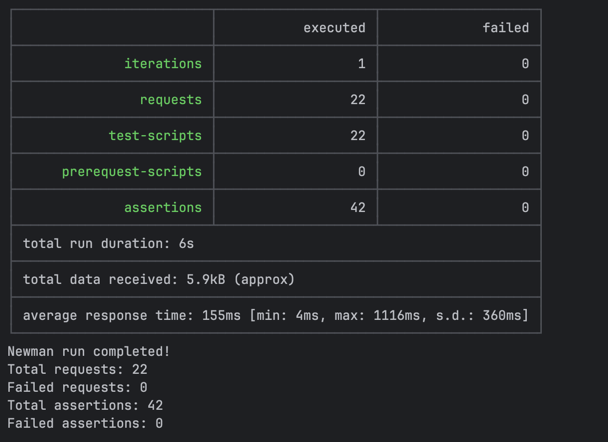

## Изучите [README.md](README.md) файл и структуру проекта.

## Задание 1. Архитектура КиноБездна (To-Be)

### Основные домены

- **Auth Service** — регистрация, авторизация, управление токенами.
- **User Service** — управление профилем пользователя.
- **Movies Service** — метаданные фильмов, рейтинги, жанры.
- **Payments Service** — платежи и подписки.
- **Events Service** — события системы (просмотры, рейтинги, платежи, авторизация).

### Интеграционное взаимодействие

- **API Gateway** — фронтовая точка для клиентов, маршрутизация между сервисами и монолитом.
- **Kafka** — обмен событиями между сервисами (Movies, Billing, Events) и внешними системами.
- **PostgreSQL** — каждая сервисная группа может иметь отдельную схему или базу данных.
- **S3** — хранение контента.
- **Внешние интеграции** — синхронно через REST/gRPC или асинхронно через Kafka.

### Контейнерная диаграмма (C4)

### Ключевые моменты

- **Единая точка входа**: API Gateway скрывает внутреннюю архитектуру.
- **Постепенная миграция**: Монолит остаётся до переноса всего функционала.
- **Событийная интеграция**: Kafka используется для асинхронных процессов (рекомендации, аналитика).
- **Микросервисная изоляция**: Каждый сервис имеет собственную логику и доступ к данным.
- **Инфраструктура готова к Kubernetes и Helm**: сервисы контейнеризируются и оркестрируются.

## Задание 2. Proxy и Events (Kafka) Services

### Результаты тестов

### Логи обработки событий

### Состояния топиков Kafka

## Задание 3

### Список подов

### Логи Events Service

### Получение списка фильмов

## Задание 4

### Скриншот развертывания helm

## Задание 5

